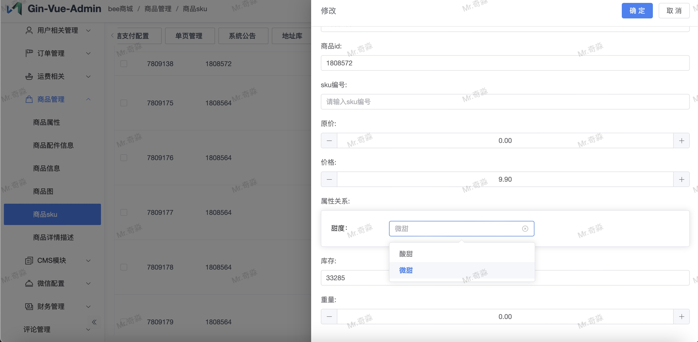

# bee-api

#### 介绍
微信小程序-餐饮点餐外卖商城的go后端实现，代码完全开源，商用请联系作者授权

针对餐饮行业推出的一套完整的餐饮解决方案，实现了用户在线点餐下单、外卖、叫号排队、支付、配送等功能，完美的使餐饮行业更高效便捷！

- 小程序端（原版）：https://github.com/woniudiancang/bee 
- 修改后的小程序端（建议使用）：https://github.com/cocktail18/bee


##### api 在线体验地址：
[https://bee.fbsst.top](https://bee.fbsst.top)

subDomain: `cocktailBeeOrder`

##### 管理后台在线体验地址：
[http://bee-admin.fbsst.top](http://bee-admin.fbsst.top)
账号：bee-demo  密码：123456

#### 软件架构

- api 使用 gin + gorm + mysql + redis
- 后台使用 gva 框架 https://www.gin-vue-admin.com


#### 目录说明
- server：管理后台代码
- web: 管理后台前端代码
- bee-api: api服务端代码


#### 安装教程

1.  安装go 1.22
2.  安装mysql or mariadb
3.  cd server && mv config.yaml.demo config.yaml && go run main.go  # 启动后端，如果没有科学上网先执行： `go env -w GOPROXY=https://goproxy.cn,direct`
4.  cd web && npm run serve # 启动前端
5.  点击前往初始化，根据需要配置账号密码、数据库账号密码
6.  重启下后端服务，(使用修改后的[小程序端](https://github.com/cocktail18/bee)可以跳过步奏7、8)
7.  将小程序的 config.js 的 subDomain 改成对应的subDomain, 默认是 cocktailBeeOrder
8.  将小程序的 miniprogram_npm/apifm-wxapi/index.js 的 API_BASE_URL 改为对应的域名， 默认开发环境：http://127.0.0.1:18083
9.  默认api端口：18083，管理后台：8888，可以使用nginx进行代理（建议）

#### 使用 docker 启动

1. 确定已安装好 `docker`、`docker-compose` 并且配置好了国内代理
2. 执行 `make run-dev`，默认前端端口 8080、api端口 8888
3. 如果需要可以修改对应的配置文件，`config.docker.yaml`

#### 使用说明

1.  配置小程序APPID/SECRET （必须）
    管理后台-》bee 商城-》微信配置-》小程序配置 （没有则新增一条）
2.  配置微信支付
    管理后台-》bee 商城-》微信配置-》微信支付配置 （没有则新增一条）
3.  启动前端项目
4.  api项目已经继承在管理后台项目中，不需要单独启动


#### FAQ
1. 启动没有看到菜单

   a. 检查用户授权，进入后台-》超级管理员-》设置权限，勾选需要的权限，注意角色api 的也要勾选，如果不确定需要什么权限，直接全选即可
2. 小程序文件上传报错

   a.  搜索小程序的 miniprogram_npm/apifm-wxapi/index.js，将 `url: 'https://oss.apifm.com/upload2',` 替换成 `url: http://127.0.0.1:18083/upload2,`
3. 怎样使用云存储

    a.  修改配置文件 config.yaml   
```yaml
system:
    oss-type: local # 将这个改成你想要的云存储类型，目前支持：tencent-cos、

# 修改对应的云存储配置，比如说qiniu 
qiniu:
  zone: ZoneHuaDong
  bucket: YOUR_BUCKET_NAME
  img-path: http://xxxx.com
  access-key: YOUR_ACCESS_KEY
  secret-key: YOUR_SECRET_KEY
  use-https: false
  use-cdn-domains: false
```
目前支持的类型：
qiniu
tencent-cos
aliyun-oss
huawei-obs
aws-s3

4. 获取配送费失败，请检查配送配置: 无效的门店编号

    商店信息里面找到 `快递门店编号` 配置，填上即可

5. 如何配置dada配送

    a. 到达达官网申请开通商户号以及开发者账号 [http://newopen.imdada.cn/#/](http://newopen.imdada.cn/#/) 

    b. 在 `bee商城/运费相关/配送供应商配置` 配置页面增加一条配置,内容为上一步奏获得的 app_key 、app_secret 、app_id，测试的时候可以打开debug开关，防止无效扣费

    c. 在 `bee商城/商城基本信息/商店信息` 配置页面找到对应的商铺，`生鲜配送` 配置填`dada`,`快递门店编号`配置填第一步获得的快递门店编号，默认是用户支付之后就通知配送商，如果想要手动通知，将`配送接单需商家确认`配置设置为true

    d. 在 `bee商城/运费相关/配送信息` 配置页新增一条记录，内容为你想要的配送费配置, 注意不是运费模板模块，目前运费模板暂时没效果

6. dada配送、微信支付没有回调
   
    a.  这是因为本地用的是内网地址，外网无法访问，需要使用内网穿透或者发布到有外网的机器，同时需要修改`config.yaml` 配置文件， 参考：
    ```
    bee-shop:
       host: "改成你的域名"
    ```

7. 云喇叭配置

   a. 先到云喇叭官网开通账号 [https://pao.ylb.io/open/sandbox/developer/register](https://pao.ylb.io/open/sandbox/developer/register)

   b. 在 `bee商城/运费相关/配送供应商配置` 配置页面增加一条配置, app_key 对应上一步的 appId ， app_secret 对应上一步的 secret，source_id 填正式的云喇叭接口 host
 
   c. 在云喇叭申请开发者账号页面配置授权接入的H5页面地址: {{host}}/yunlaba/bind.html

   d. 在 `bee商城/运费相关/绑定云喇叭账户` 填入上一步获得的信息 

   d. 在 `bee商城/商城基本信息/商店信息` 配置页面找到对应的商铺，`生鲜配送` 配置填`yunlaba`, 注意是 `yunlaba`,`快递门店编号`配置为跟shop_id一样的值
   
   e. 云喇叭接口测试方法· [https://console-docs.apipost.cn/preview/100a3773567008af/77e6c9c9a13d21be?target_id=2cc8aef0-70a9-4f50-9e22-daa57cf8d01b#user-content-测试方法](https://console-docs.apipost.cn/preview/100a3773567008af/77e6c9c9a13d21be?target_id=2cc8aef0-70a9-4f50-9e22-daa57cf8d01b#user-content-测试方法)

8. 下单提示获取地址失败

   a. 检查 `bee商城/商城基本信息/商店信息` 里面的 `生鲜配送` 配置项，目前只支持 `dada` 跟 `yunlaba`
   
   b. 如果是使用云喇叭配送，在小程序端全局替换
   `if (this.data.shopInfo && this.data.shopInfo.number && this.data.shopInfo.expressType == 'dada' && postData.peisongType == 'kd') {`
为 `if (this.data.shopInfo && this.data.shopInfo.number && (this.data.shopInfo.expressType == 'dada'||this.data.shopInfo.expressType == 'yunlaba') && postData.peisongType == 'kd') {`

9. 错误提示
Out of range value for colunm 'longitude' 或者 Out of range value for colunm 'latitude' 的时候手动改下表结构， 表名自己替换下

   ```sql
   ALTER TABLE bee_shop_info MODIFY COLUMN longitude double(9,6) DEFAULT NULL NULL COMMENT '经度';
   ALTER TABLE bee_shop_info MODIFY COLUMN latitude double(9,6) DEFAULT NULL NULL COMMENT '纬度';
   ```

10. docker启动提示 no matching manifest for linux/arm64/v8 in the manifest list entries
   
   这个是由于 docker 默认的镜像不是arm64的，需要修改镜像为arm架构的镜像

11. bee-region.sql 不存在
   
    进qq群，群文件自行下载

   
### 后台截图





#### 功能列表

- [x] cms模块
- [x] 购物车
- [x] 运费配置
- [x] 商品管理
- [x] 优惠券
- [x] 用户管理
- [x] 订单模块
- [x] 取号叫号
- [x] 扫码点餐
- [x] 打印机，目前支持飞蛾跟大趋
- [x] 配送商，目前支持达达跟云喇叭
- [x] 充值优惠

#### 打印模板参考
```html
外卖订单详情:
订单号: {{.order.Id}}
下单时间: {{.nowStr}}

顾客信息:
姓名: {{.user.Nick}}
电话: {{.user.Mobile}}
余额: ¥{{.userCash.Balance}}

收货地址: {{if .logistics}} {{.logistics.Address}} {{else}} 无 {{end}}

订单内容:
{{range .goods}}  - {{.GoodsName}} (x{{.Number}}) - ¥{{.AmountSingle}}
{{end}}

总价: ¥{{.order.Amount}}
用户余额: ¥{{.userCash.Balance}}

额外信息: 
{{range $k, $v := .extJson}}
- {{$k}}: {{$v}}
{{end}}
```


#### QQ交流群 963437155


#### 参与贡献

1.  Fork 本仓库
2.  新建 Feat_xxx 分支
3.  提交代码
4.  新建 Pull Request

